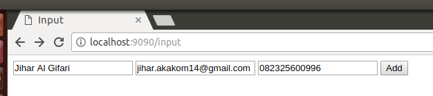
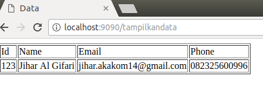

# Membuat API menggunakan gRPC berbasis web menggunakan Go

## implementasi

pastikan sudah terinstal go, protoc, dan lain lain untuk keperluan grpc

  1. `go run server/server.go` untuk menjalankan server
  2. `go run client/client.go` untuk menalankan client

  3. buka web browser anda
  4. masukan url `http://localhost:9000/input`
  
  5. masukan url `http://localhost:9000/tampilkandata`
  

  Untuk sourcecode silahkan kalian pelajri sendiri pada bagian `code`

  kalo yang belum paham di tanya saja `feel free`

untuk Reference saya menggunakan ini:

`https://medium.com/@shijuvar/building-high-performance-apis-in-go-using-grpc-and-protocol-buffers-2eda5b80771b`
